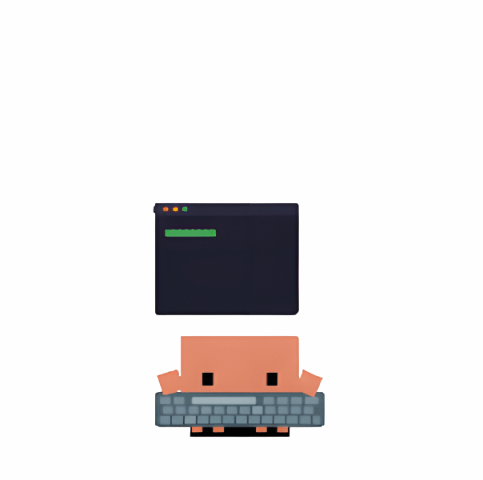

<!-- Typing SVG: 사용자가 지정한 코드로 고정 -->

  

<!-- ✨ GIF와 Dev Profile을 한 줄에 배치 (HTML 테이블 사용, 텍스트 깨짐 수정) ✨ -->
<table border="0" align="center">
  <tr>
    <td width="300px" align="center" valign="middle" style="vertical-align: middle; border: none; text-align: center;">
      <!-- GIF 크기를 333px로 조정 -->
      
    </td>
    <td width="450px" style="vertical-align: top; border: none; padding-left: 20px;">
      <h3 align="left">🧑‍💻 Character Profile</h3>
      <ul align="left" style="list-style-type: none; padding: 0; margin: 0;">
        <li style="margin-bottom: 8px;">🎓 <b>Affiliation</b>: Dongyang Mirae University (DMU)</li>
        <li style="margin-bottom: 8px;">🎮 <b>Background</b>: Ex-Game Developer (Unity & Unreal)</li>
        <li style="margin-bottom: 8px;">🏢 <b>Role</b>: Kiosk (WPF) & Mobile (Flutter)</li>
        <li style="margin-bottom: 8px;">⚡ <b>Focus</b>: Exploring Vibe Coding with AI Tools</li>
        <li style="margin-bottom: 8px;">📧 <b>Message</b>: dbsrjs1224@gmail.com</li>
        <li style="margin-bottom: 8px;">📜 <b>Log</b>: </li>
      </ul>
    </td>
  </tr>
</table>

  

<!-- Skill Inventory Section: 분류를 더 명확하게 -->
<h2 align="center">🛠️ Skill Inventory</h2>
<table align="center" border="0">
  <tr>
    <td align="center" style="border: none; padding: 10px;">
      <h3 align="center">🚀 Daily Work & Mobile</h3>
      

        
        
        
        
      

    </td>
    <td align="center" style="border: none; padding: 10px;">
      <h3 align="center">🤖 AI & Vibe Tools</h3>
      

        
        
        
      

    </td>
  </tr>
</table>

 

<h3 align="center">🎮 Origin (Game Engine)</h3>

  
  

  

<!-- Activity Summary -->
<h2 align="center">📈 Vibe Activity</h2>

  

